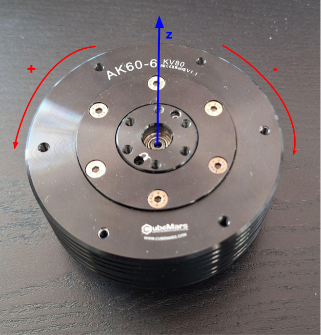

# How to use

The library lives in the KMR::CBM namespace. 

# Concept of the library

## Threading
This library uses two threads.<br/>
The Listener thread monitors messages on the CAN bus and saves their information. The main thread can access this information when required. <br/>

From a user's perspective, every interaction with the library needs to be done through a MotorHandler instance, which is the highest-level class.

## MIT mode

The control equation used by the motors is: <br/>
$$
T = Kp \cdot (p_{goal} - p_{curr}) + Kd \cdot (v_{goal} - v_{curr}) + Tff
$$

with:
- $` T `$ : input torque in Nm
- $` Kp `$: proportional factor in Nm/rad
- $` Kd `$: derivative factor in Nm/(rad/s)
- $` p_{goal} `$ and \f$ p_{curr} \f$: goal and current positions respectively, in rad
- $` v_{goal} `$ and \f$ v_{curr} \f$: goal and current speeds respectively, in rad/s
- $` Tff `$ : feedforward torque in Nm

The user can control $` Kp `$, $` Kd `$, $` p_{goal} `$, $` v_{goal} `$ and $` Tff `$, which are sent in a CAN packet to a wished motor. The motor's firmware then internally calculates the corresponding input torque $` T `$.


When controlling all 5 parameters, the user controls the motor in impedance. By setting specific parameters to 0, this control can become pure position, speed or torque control. The different types of control are illustrated by the following table:


|                   | Kp | Kd | p_goal | v_goal | Tff |
|-------------------|----|----|--------|--------|-----|
| Impedance control | Kp | Kd | p_goal | v_goal | Tff |
| Position control  | Kp | Kd | p_goal | 0      | 0   |
| Speed control     | 0  | Kd | 0      | v_goal | 0   |
| Torque control    | 0  | 0  | 0      | 0      | Tff |

# Axis definition

The motors' axis is defined as follows:


The counterclockwise rotation is therefore defined as positive.

# Using the library in practice

## Create a MotorHandler object
As mentioned previously, every interaction with the library needs to be done through a ```MotorHandler``` object. <br/>
The constructor takes 3 arguments: the list of all the motors' ids, the CAN bus name and the list of the motors' models.

For example, if one wants to control those two motors:
- AK80_8 with id = 1
- AK60_6 with id = 2

then the ```MotorHandler``` object is created as follows: 

```cpp
#include "KMR_CubeMars.hpp"

int main()
{
    std::vector<int> ids = {1, 2}; 
    std::vector<KMR::CBM::Model> models{KMR::CBM::Model::AK80_8, KMR::CBM::Model::AK60_6};
    const char* can_bus = "can0";

    KMR::CBM::MotorHandler motorHandler(ids, can_bus, models);
}
```

> [!warning]
> The order of the motor IDs sent in the "ids" vector is important: in any function with an effect on all motors, the order of the inputs or outputs is the same as the order of the ids vector.

## Disable torque
The motor(s) torque can be disabled at any time by using the ```stopMotors()``` method, or any of its overloads. <br/>
Sending a control command will automatically set a torque again.

##  Zero setting

Due to CubeMars motors' using a single encoder, the motors lose their reference position (also called zero position) on power-off. Thus, the first thing a user needs to do is to set the zero-position of the motors by using the ```setZeroPosition()``` method, or one of its overloads. <br/> 
Those functions take the current motor positions as the new zero positions, and then enable the motors' torques to maintain the current (zero) position.

## Control modes

For a refresher about the torque equations and parameters, refer to the "MIT mode" section at the top of this page.

### Impedance control mode 
In order to control the motors in impedance, the ```setCommand()``` method or its overload are to be used. Both those functions require all five torque equation parameters, for all input motors.

The next control modes functions all use the ```setCommand()``` method in the background, but they handle setting the appropriate parameters to zero for the user's convenience.

### Position control mode 
To control the motors in position, use the ```setPositions()``` methods. <br/> 
In position control, Kp and Kd are (usually) constant and tuned accordingly to the system. In order to avoid having to always send the same constant Kp and Kd in setPositions(), the methods ```setKps()``` and ```setKds()``` were created.

Those two methods need to be used before starting the position control. They save respectively the Kps and Kds of the input motors, and thus setPositions() does not take Kp and Kd as inputs. The library will throw a critical error in case setPositions() is called on a motor without previously setting its Kp and Kd.

### Speed control mode
Very similarly to the position control, the ```setSpeeds()``` methods can be used after using the ```setKds()``` method (as a reminder, Kp is automatically set to 0 in speed control mode).

### Torque control mode
To control the motors in torque, use the ```setTorques()``` methods.

## Get feedbacks
Motors send 4 feedbacks:
- position
- speed
- torque
- temperature

The user can get all feedbacks when using the ```getFeedbacks()``` methods.  

For convenience, the methods ```getPositions()``` , ```getSpeeds()``` , ```getTorques()``` and ```getTemperatures()``` have been created, each outputting only the respective feedback type. 

However, in the background, it is the getFeedbacks() method that is used, and the unnecessary feedbacks types are discarded. Thus, if the user is interested in more than one feedback type, it is faster to directly use getFeedbacks() instead of for example calling getPositions() and immediately afterwards getSpeeds().

> [!warning]
> \- **VERY IMPORTANT**: when getting feedbacks with CubeMars motors, it is important to know whether the motors are in motion or not. <br/>
> \- Every feedback function has a boolean ```moving``` argument, by default set to 1. When getting feedback in the middle of the control program, this argument is thus not required. <br/>
> \- When getting feedbacks before starting the control sequence (eg during initializations), this argument needs to be set to 0. <br/>
> \- It is highly recommended to read the background explanation just below to better understand this argument

*Background explanation*: according to the [CubeMars AK series driver manual](https://www.cubemars.com/images/file/20240611/1718085712815162.pdf), sending the "Enter Motor Control Mode" command can be used as a means to get feedback from motors in a stateless manner. <br/>
However, after testing and confirmed by CubeMars themselves after inquiry, it turns out that using the "Enter Motor Control Mode" command when the motor is in motion results in the motor jumping, incorrect readings and an overall undefined behavior, which is dangerous on top of being unusable. <br/>
The way to remedy this is to get feedbacks by resending the previous control command instead of sending the "Enter Motor Control Mode" command. 

This library's ```moving``` argument in the feedback functions thus serves to define whether the feedback should be gotten via the "Enter Motor Control Mode" command (before starting the control, or when idle), or via resending the previous control command when in the middle of control.


## Maintain position
Regardless of the current control mode, zero set or not, torque disabled or not, the ```maintainPosition()``` method can be used at any time to maintain the motors' current position.

> [!note]
> Note that this function uses the same ```moving``` boolean argument as the feedback-getting functions.
> This is because the position maintaining method first needs to read the current feedback position, and reuse it as the position input in order to maintain the motor at the current position.


# Examples summary
The examples are designed for a single motor, by default a AK60_6 model with ID = 1. The user can easily edit the examples according to their setup. 

The executables are created on library compilation, and can be found in the ```KMR_CubeMars/build``` folder.

The examples included are as follows:

| Example             | Description                   |
|---------------------|-------------------------------|
| ex1_impendance      | Impedance control showcase    |
| ex2_position        | Position control showcase     |
| ex3_speed           | Speed control showcase        |
| ex4_torque          | Torque control showcase       |
| singleThread        | Hardware check                |
| PID_tuning          | Simple code to tune Kp and Kd |

- The first 4 examples showcase different mode controls.
- The executable ```singleThread``` is a simple test, not even using the library. It only enables, then disables the motor, while measuring the response latency. Its goal is to make sure the hardware is correctly set up (for example, the CAN controllers correctly wired), without having potentially advanced sources of problems such as multithreading coming into play. As indicators, sending each enable/disable command should take around 100-130 microseconds, while the confirmations from the motor should come after around 200-400 microseconds. <br/>
- The executable ```PID_tuning``` allows a user to tune Kp and Kd. The first part of the program tests the response to a typical impulse that can be expected per control loop (by default, a 200Hz control loop with a speed of 360°/s). The second part executes a full trajectory. The feedbacks of both tests are logged into csv files. The user can use the python script ```python_scripts/PID_tuning.py``` to plot the results. 

> [!caution]
> As per usual when tuning Kp and Kd, make sure to start with low values of Kp in order to avoid jumps or oscillations, then progressively increase that value.

> [!tip]
> In the default settings (200 Hz control loop, with a maximum speed of 360°/s), the tuned Kp = 150 and Kd = 1 for a AK60_6 without load.